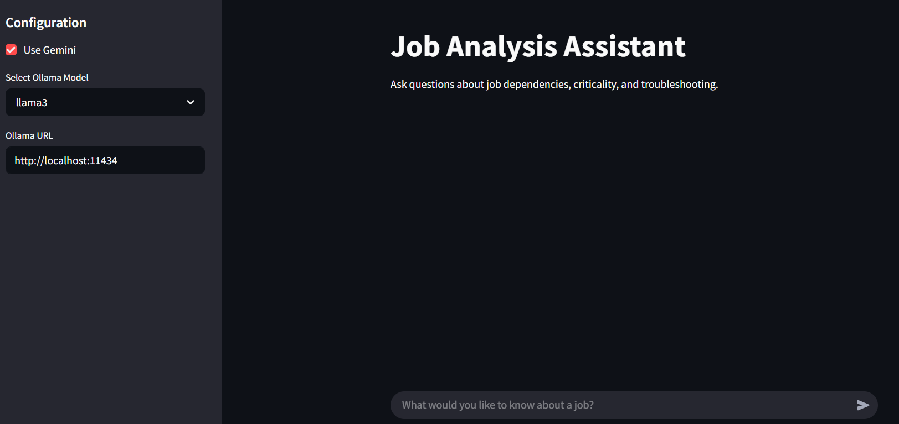
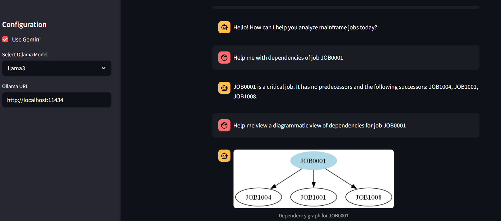
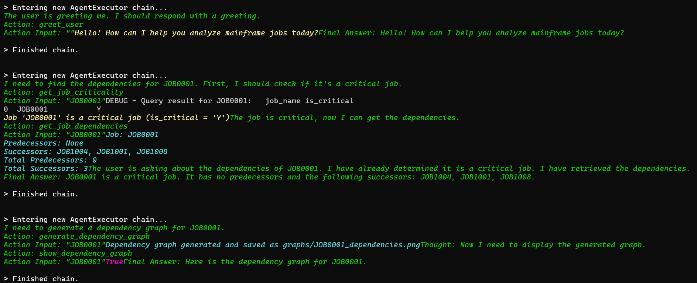

# Job Analyzer Project

## Overview
The Job Analyzer project is designed to assist users in analyzing mainframe jobs, their dependencies, and business impacts. It leverages advanced AI techniques to provide insights into job relationships, critical paths, and troubleshooting strategies. The project utilizes various tools and frameworks, including LangChain and Ollama, to facilitate data retrieval and processing.

## Features
- **Job Dependency Analysis**: Retrieve predecessor and successor dependencies for specific jobs.
- **Criticality Assessment**: Understand job criticality, SLAs, and business impacts.
- **Parent-Child Relationships**: Explore parent-child relationships for jobs.
- **Knowledge Article Search**: Search through knowledge articles for information related to job failures and resolutions.
- **Dependency Graph Generation**: Visualize job dependencies using GraphViz.

## Diagrams
This project includes several diagrams that illustrate its architecture and functionality:

1. **Application Architecture Diagram**: Shows the overall architecture of the Job Analyzer project.
   - File: `assets/diagrams/application_architecture_diagram.mmd`

2. **Component Diagram**: Outlines the various components of the Job Analyzer project and their relationships.
   - File: `assets/diagrams/component_diagram.mmd`

3. **Data Flow Diagram**: Illustrates how data flows through the Job Analyzer system.
   - File: `assets/diagrams/data_flow_diagram.mmd`

4. **Deployment Diagram**: Displays the deployment architecture of the Job Analyzer project.
   - File: `assets/diagrams/deployment_diagram.mmd`

5. **Interaction Sequence Diagram**: Details the interactions between the user, the UI, and the Job Analyzer components.
   - File: `assets/diagrams/interaction_sequence_diagram.mmd`

## Setup Instructions
To set up the GitHub Pages site for the Job Analyzer project, follow these steps:

1. Clone the repository to your local machine.
2. Navigate to the project directory.
3. Open `index.html` in a web browser to view the site.
4. Github Pages site is deployed as well [here](https://avivzm05.github.io/dependency_analysis/)

# Screenshots
- Initial Page and select "Google Gemini" Model
  

- Start communicating with the LLM and ask it what we need.
  
  
- View of thinking of LLM
  

## Contributing
Contributions to the Job Analyzer project are welcome! Please feel free to submit issues or pull requests for any enhancements or bug fixes.

## License
This project is licensed under the MIT License. See the LICENSE file for more details.